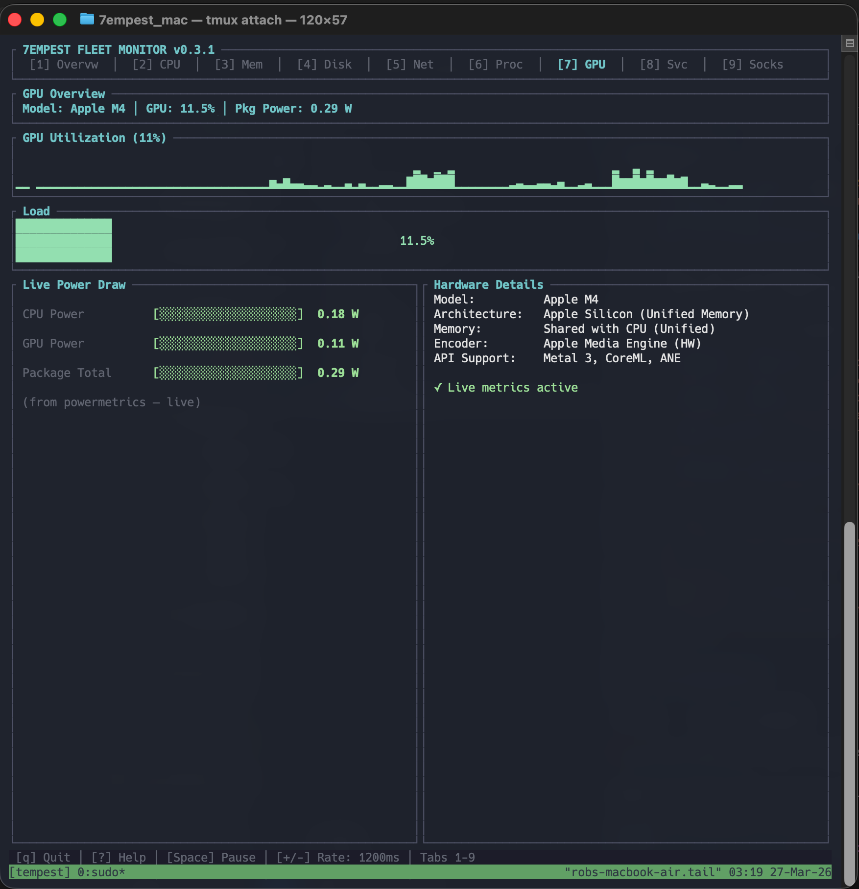
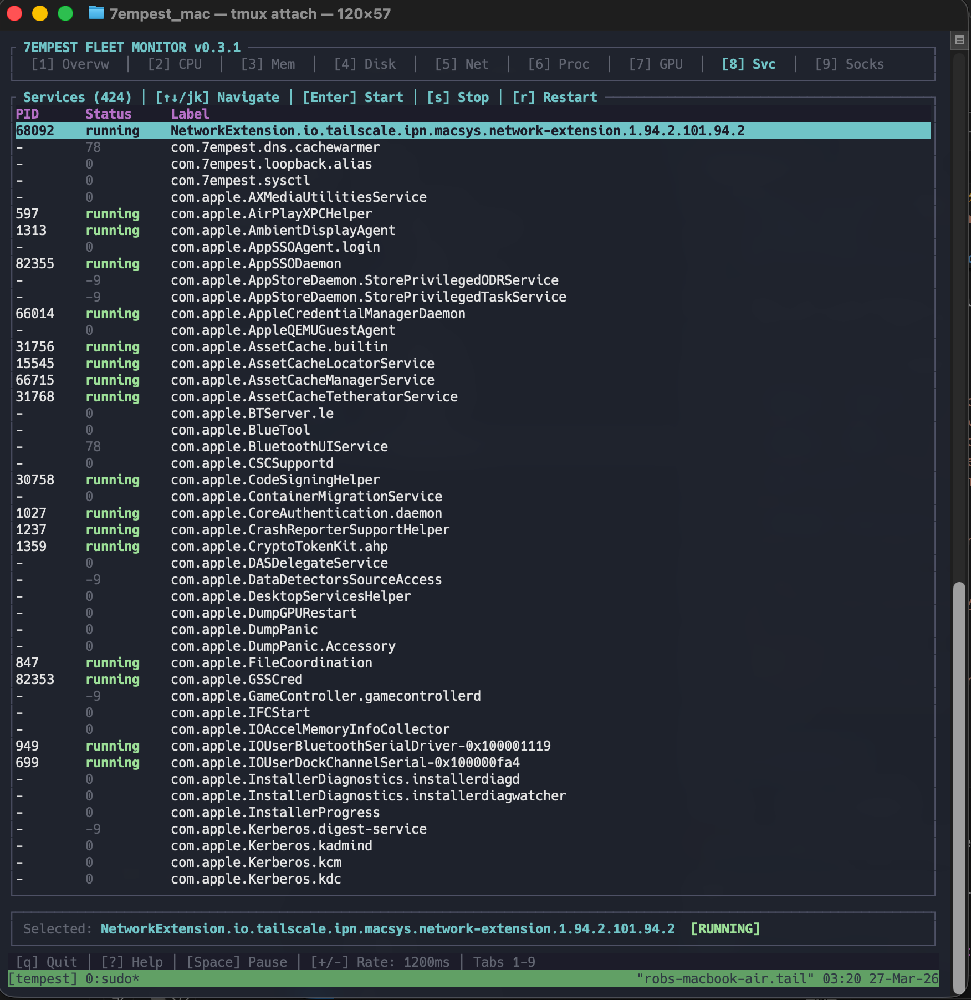
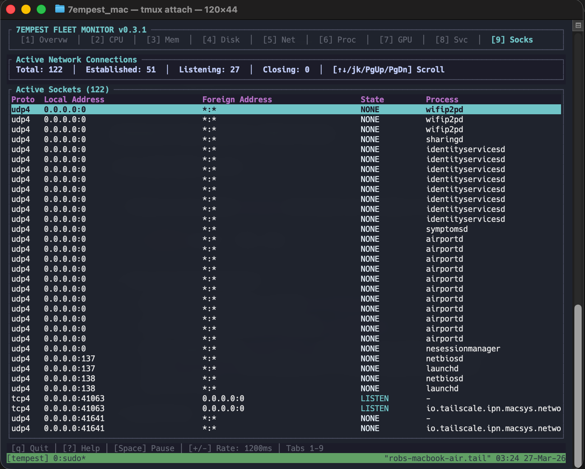

# Tempest Monitor ⚡️ [](https://opensource.org/licenses/MIT)

A stunning, real-time terminal system monitor (TUI) for macOS and Linux, built with Rust.

## Gallery






## Features

- 📊 **Real-time Overview**: Instant view of your system's health.
- 💻 **CPU Monitoring**: Per-core history and global usage sparklines.
- 🧠 **Memory Tracking**: RAM and SWAP usage with detailed breakdowns. Includes **compressed memory** reporting for macOS.
- 📂 **Disk I/O**: Live monitoring of disk read/write activities.
- 🌐 **Network traffic**: History of received and transmitted data across all interfaces (MAC, Speed, Driver).
- 💿 **Socket Connections**: Native high-performance socket listing (Protocols, Local/Remote IPs, Connection States).
- ⚙️ **Process Management**:
  - Sort by CPU, Memory, PID, Name, Disk I/O, or Virtual Memory.
  - Interactive **Signal Menu** (SIGTERM, SIGKILL, etc.).
  - **Tree View** mode to visualize parent-child relationships.
  - Powerful **Regex Filtering** to find exactly what you need.
- 🎯 **Focus Mode**: Zero-in on a single process with dedicated high-res time-series charts.
- 🔔 **Intelligent Alerting**: Desktop notifications for customizable threshold breaches (CPU, RAM, etc.).
- 💾 **Historical Persistence**: 7-day rolling window of system metrics stored in a local SQLite database.
- 📈 **Observability**: Prometheus-compatible exporter and PNG/JSON machine-state snapshots.
- 🚀 **Full Async Engine**: Decoupled UI and data collection powered by `tokio` for perfect responsiveness.

## 🔋 Battery & Hardware Monitoring

- **Battery Status**: Shows percentage, state (Charging/Discharging), and time remaining.
- **Thermal Sensors**: Monitors temperatures across various system components.
- **GPU Monitoring (v0.3.4)**: Dedicated tab for GPU utilization, clock speeds, and power draw.
    - **macOS**: High-fidelity metrics via `powermetrics` (requires sudo) with a **reliable fallback** to `ioreg` (no sudo required) for privilege-free usage monitoring. Optimized for **Apple M4**.
    - **Linux (AMD/Intel)**: Temperature, GPU clock, VRAM usage, and GPU busy % via `sysfs` / `hwmon`.
    - **Linux (NVIDIA)**: Professional monitoring via `NVML`.

## 🛡️ High-Privilege Monitoring

Some advanced features require elevated privileges to access hardware statistics:
- **GPU Utilization**: On macOS, `powermetrics` requires `sudo`.
- **System Services**: On macOS, managing `launchctl` services requires `sudo`. On Linux, `systemctl` services are listed automatically (user + system).
- **Sockets/Processes**: Full process metadata (compressed memory) requires `sudo`.

To run without typing your password every time, you can add this to your `/etc/sudoers` (using `visudo`):
```text
your_username ALL=(ALL) NOPASSWD: /path/to/tempest-monitor
```

## Usage Guide & Tabs

Tempest Monitor is designed for both speed and depth. Press `1`-`9` or use `Tab` to cycle.

- `1`: **Overview** - High-level dashboard of everything at once.
- `2`: **CPU** - Detailed per-core usage, frequency, and thermal mapping.
- `3`: **Memory** - Deep dive into RAM, SWAP, and macOS **Compressed Memory**.
- `4`: **Disks** - Live monitoring of all mounted volumes and I/O.
- `5`: **Network** - Per-interface traffic stats and interface info (MAC, Speed, Duplex).
- `6`: **Processes** - The interactive task manager. Hit `Enter` for Focus Mode or `k` for Signal Menu.
- `7`: **GPU** - Real-time utilization and power consumption charts.
- `8`: **Services** - macOS: Interactive `launchctl` manager. Linux: `systemd` unit browser. Start/Stop with `Enter`/`s`.
- `9`: **Sockets** - Real-time network socket enumeration (replacing `netstat`).

## Controls

| Key | Action |
|-----|--------|
| `1`-`9` | Switch between tabs |
| `Tab` / `Shift+Tab` | Cycle through tabs |
| `Enter` | **Focus Mode** (Processes) / Start Service (Services) |
| `q` / `Ctrl+C` | Quit |
| `?` | Toggle help menu |
| `Space` | Pause/Resume refreshing |
| `+` / `-` | Increase/Decrease refresh rate |
| `j` / `k` (or arrows) | Navigate lists |
| `/` | Start filtering processes |
| `r` | Toggle Regex mode for filtering |
| `t` | Toggle Tree View |
| `d` | Toggle detailed process panel |
| `k` | Open Signal Menu for selected process |
| `F1`-`F6` | Quick sort options |

## Installation

### From GitHub Releases (Recommended)
Download the pre-compiled binary for your architecture from the [GitHub Actions artifacts](https://github.com/7empest462/tempest-monitor/actions) or the Releases page.

### From Source
Ensure you have [Rust](https://rustup.rs/) installed.

#### Linux Build Dependencies

Some Linux distributions require additional development libraries before compiling:

| Distro | Install Command |
|--------|----------------|
| **Debian / Ubuntu** | `sudo apt install libfontconfig1-dev libssl-dev pkg-config` |
| **Fedora / RHEL** | `sudo dnf install fontconfig-devel openssl-devel pkg-config` |
| **Arch Linux** | `sudo pacman -S fontconfig openssl pkgconf` |
| **SteamOS (Steam Deck)** | `sudo steamos-readonly disable && sudo pacman -S fontconfig openssl pkgconf` |

```bash
git clone https://github.com/7empest462/tempest-monitor.git
cd tempest-monitor
cargo build --release
cp target/release/tempest-monitor ~/.local/bin/  # Move to PATH
```

## Automations

This project uses **GitHub Actions** to automatically build binaries for both macOS and Linux on every push.

## License

This project is licensed under the MIT License - see the [LICENSE](LICENSE) file for details.

---
