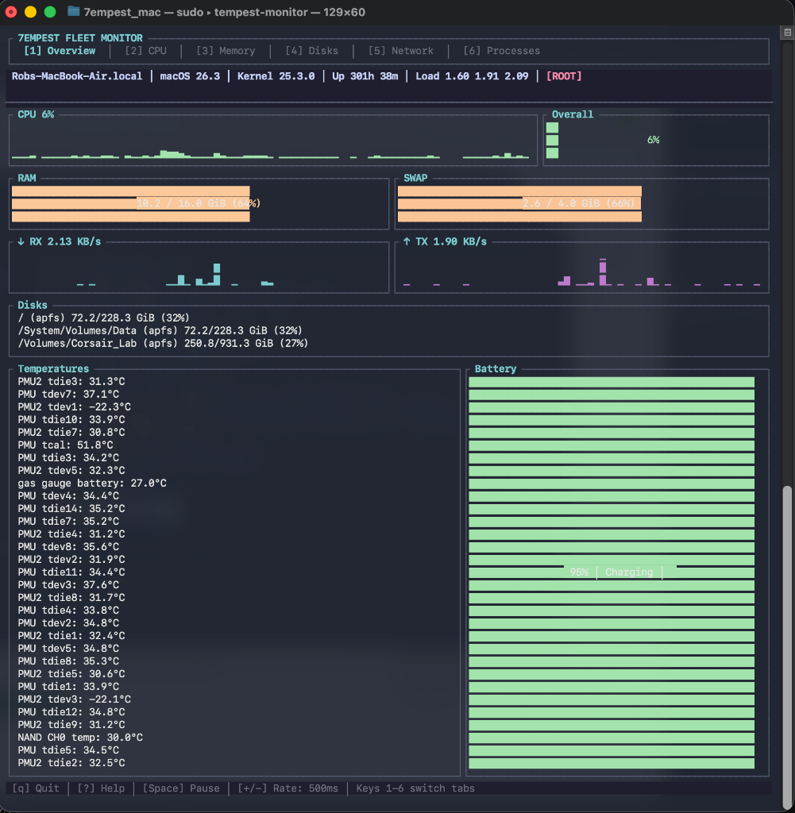
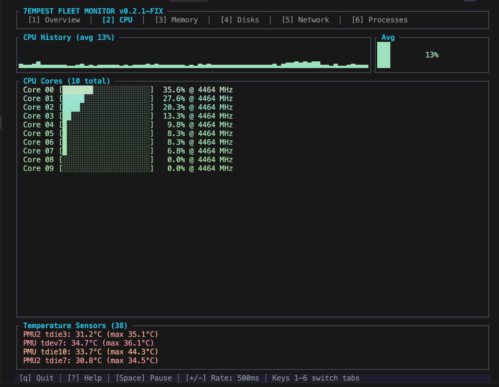
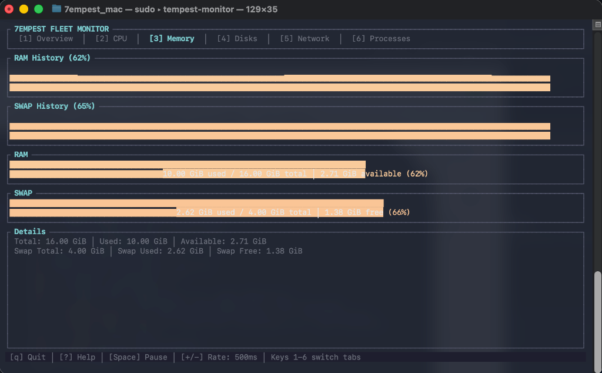
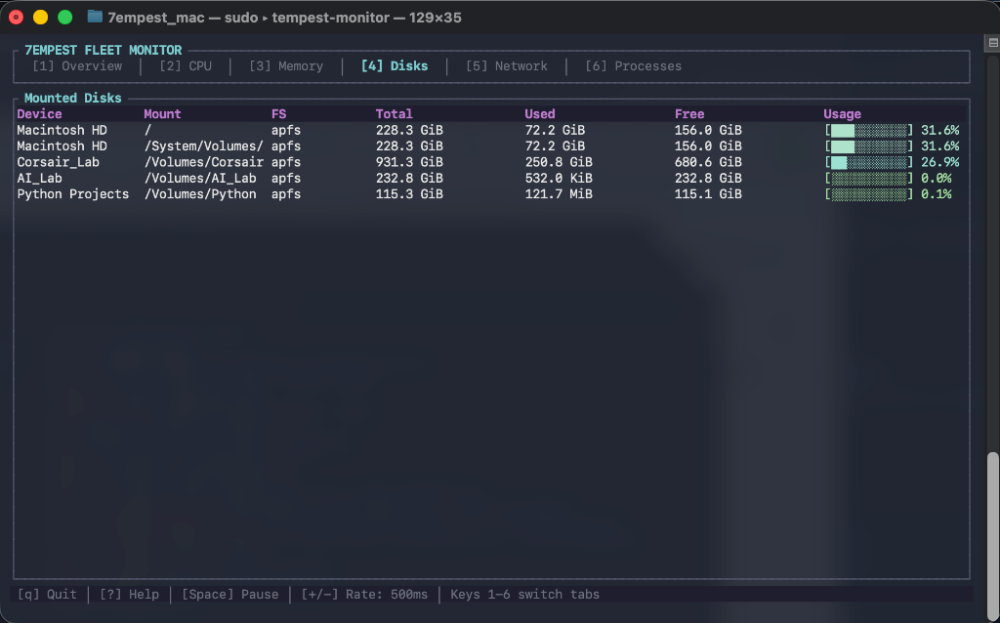
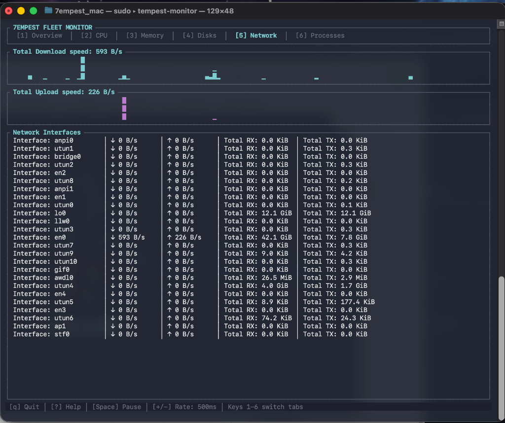
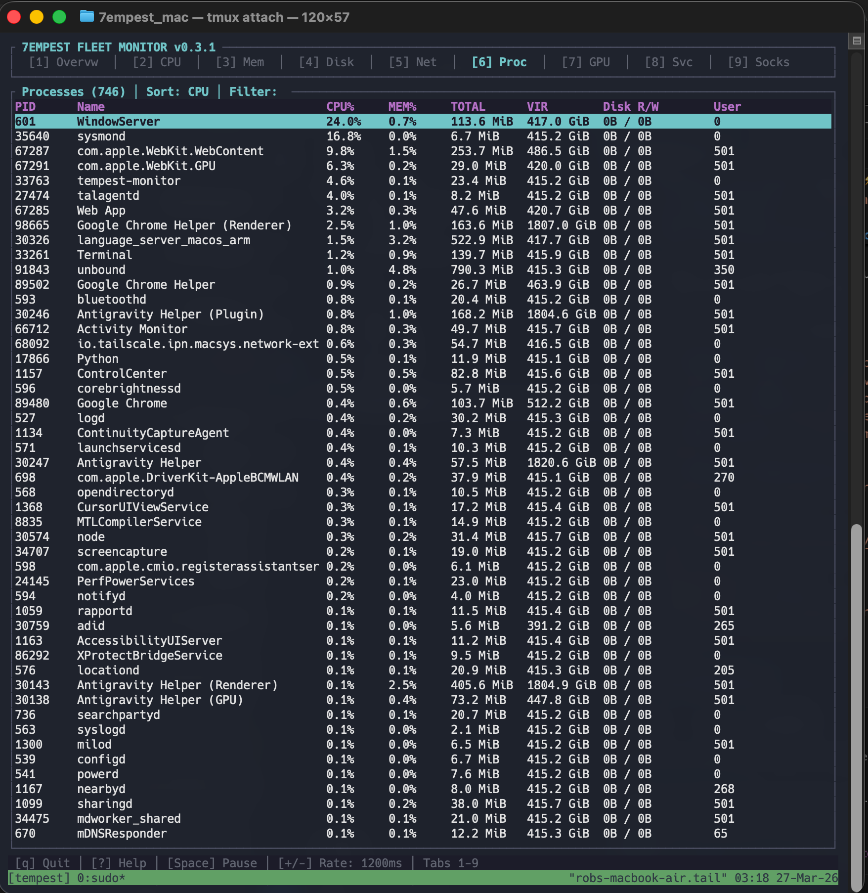

# Tempest Monitor ⚡️ [](https://opensource.org/licenses/MIT)

A stunning, real-time terminal system monitor (TUI) for macOS and Linux, built with Rust.

## Gallery








## Features

- 📊 **Real-time Overview**: Instant view of your system's health.
- 💻 **CPU Monitoring**: Per-core history and global usage sparklines.
- 🧠 **Memory Tracking**: RAM and SWAP usage with detailed breakdowns. Includes **compressed memory** reporting for macOS.
- 📂 **Disk I/O**: Live monitoring of disk read/write activities.
- 🌐 **Network traffic**: History of received and transmitted data across all interfaces.
- 🌡 **Thermal Monitoring**: 
  - Real-time tracking of PMU, CPU, Battery, and NAND sensors.
  - Monitors both **current** and **maximum** recorded temperatures.
  - Heat-aware color coding: Sensors transition from 🟢 to 🟡 and 🔴 as they approach their maximum safe thresholds.
- 🔋 **Battery Status**: Percent, state, and time remaining (if applicable).
- 🛠 **Process Management**:
  - Sort by CPU, Memory, PID, Name, Disk I/O, or Virtual Memory.
  - Interactive **Signal Menu** (SIGTERM, SIGKILL, etc.).
  - **Tree View** mode to visualize parent-child relationships.
  - Powerful **Regex Filtering** to find exactly what you need.
- 🚀 **Cross-Platform**: Fully supports macOS (Apple Silicon native) and Linux (via statically linked musl binaries).

## Usage Guide

Tempest Monitor is designed for both speed and depth. You can quickly switch between views or dive into individual processes.

### Dashboard Navigation

You can move through the different tabs using numeric keys or cycling:

- **Direct Switch**: Press keys `1` through `6` to jump directly to a tab:
  - `1`: **Overview** - A high-level dashboard of everything at once, including **live temperature readings** and battery health.
  - `2`: **CPU** - Detailed per-core usage, frequency tracking, and **comprehensive thermal data** (current vs max temperatures).
  - `3`: **Memory** - Deep dive into RAM, SWAP, and macOS compressed memory.
  - `4`: **Disks** - Live monitoring of all mounted volumes and I/O.
  - `5`: **Network** - Per-interface traffic stats and history.
  - `6`: **Processes** - The interactive task manager and signal menu.
- **Tab Cycling**: Use `Tab` (forward) or `Shift+Tab` (backward) to move through the views sequentially.
- **Mouse Support**: You can also click the tab headers or use the mouse wheel to scroll through lists.

### Advanced Process Management (Tab 6)

The Processes tab is the most powerful part of the monitor:

1.  **Active Sorting**: Use `F1`-`F6` to instantly sort by different metrics (CPU, MEM, PID, Name, etc.). Pressing the same key twice flips the order (Ascending/Descending).
2.  **Real-time Filtering**: Simply start typing anywhere on the Processes tab. The list will filter as you type.
    -   **Regex Mode**: Press `r` to toggle Regular Expression mode for advanced searches.
    -   **Clear Filter**: Press `/` or `Esc` to clear the current search.
3.  **Control (k)**: Press `k` on a highlighted process to open the **Signal Menu**. From here, you can send `SIGTERM`, `SIGKILL`, `SIGSTOP`, etc., to manage unresponsive apps.
4.  **Views**: 
    -   Press `t` to toggle **Tree View**, showing which processes spawned others.
    -   Press `d` to toggle the **Detail Panel** for a deep look at a single process's metadata.

## Controls

| Key | Action |
|-----|--------|
| `1`-`6` | Switch between tabs |
| `Tab` / `Shift+Tab` | Cycle through tabs |
| `q` / `Ctrl+C` | Quit |
| `?` | Toggle help menu |
| `Space` | Pause/Resume refreshing |
| `+` / `-` | Increase/Decrease refresh rate |
| `j` / `k` (or arrows) | Navigate process list |
| `/` | Start filtering processes |
| `r` | Toggle Regex mode for filtering |
| `t` | Toggle Tree View |
| `d` | Toggle detailed process panel |
| `k` | Open Signal Menu for selected process |
| `F1`-`F6` | Quick sort options |

## Installation

### From GitHub Releases (Recommended)
Download the pre-compiled binary for your architecture from the [GitHub Actions artifacts](https://github.com/7empest462/tempest-monitor/actions) or the Releases page.

### From Source
Ensure you have [Rust](https://rustup.rs/) installed.

```bash
git clone https://github.com/7empest462/tempest-monitor.git
cd tempest-monitor
cargo build --release
./target/release/tempest-monitor
```

## Automations

This project uses **GitHub Actions** to automatically build binaries for both macOS and Linux on every push. You can find the latest builds in the "Actions" tab of this repository.

## License

This project is licensed under the MIT License - see the [LICENSE](LICENSE) file for details.

---
